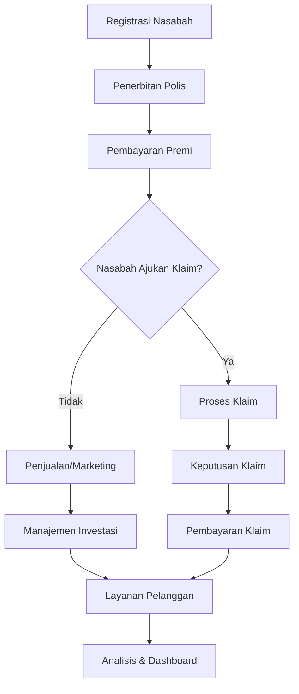
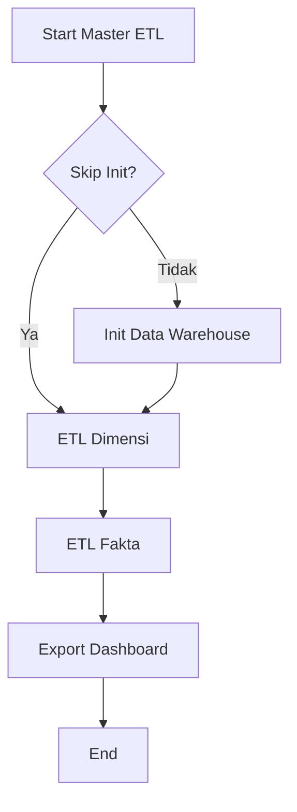

# Proyek Data Warehouse Asuransi

## 📋 Ringkasan Proyek

Proyek ini membangun solusi data warehouse komprehensif untuk perusahaan asuransi, menyediakan kapabilitas business intelligence untuk menganalisis pendaftaran nasabah, klaim, aktivitas penjualan, investasi, dan layanan pelanggan. Proyek ini mengikuti prinsip dimensional modeling dengan desain star schema dan mengimplementasikan pipeline ETL menggunakan Apache Airflow.

## 🏗️ Arsitektur

### Stack Teknologi
- **Database**: PostgreSQL (Sumber & Data Warehouse)
- **Orkestrasi ETL**: Apache Airflow
- **Pembuatan Data**: Python (Pandas, Faker)
- **Infrastruktur**: Docker, Docker Compose
- **Bahasa Pemrograman**: Python 3.7+

### Struktur Proyek
```
├── README.md
├── docker-compose.yml
├── environment.yml
├── requirements.txt
├── airflow/
│   ├── dags/                    # DAG Airflow
│   ├── config/                  # Konfigurasi database
│   ├── sql/                     # Skrip SQL pembuatan tabel
│   └── logs/                    # Log Airflow
├── data/
│   ├── raw/                     # Data CSV hasil generate
│   └── dashboard/               # Data ekspor dashboard
├── docs/
│   ├── erd.md                   # ERD
│   ├── star_schema.md           # Dokumentasi star schema
│   └── task.md                  # Checklist proyek
└── src/
    └── data_generation/         # Skrip pembuatan data
```

## 🏢 Ringkasan Proses Bisnis

### Proses Bisnis Inti Asuransi

Data warehouse ini menangkap dan menganalisis 5 proses bisnis utama di industri asuransi:

#### 1. **Pendaftaran Nasabah & Penerbitan Polis**
- Nasabah mendaftar melalui agen/online, memilih produk, dilakukan penilaian risiko, polis diterbitkan, dan dokumen diberikan ke nasabah.
- Setiap nasabah bisa punya banyak polis, premi tergantung produk dan risiko, ada program referral, dan masa polis bervariasi.

#### 2. **Proses Klaim & Penyelesaian**
- Nasabah mengajukan klaim, dilakukan investigasi, verifikasi dokumen, evaluasi, keputusan, dan pembayaran jika disetujui.
- Ada batas waktu klaim, nilai klaim maksimal sesuai polis, approval bertingkat, deteksi fraud, dan SLA penyelesaian.

#### 3. **Aktivitas Penjualan & Marketing**
- Kampanye marketing, lead generation, kontak sales, presentasi produk, negosiasi, penutupan polis.
- Aktivitas sales dicatat per karyawan/program, komisi dihitung, conversion rate dipantau, dan analisis ROI marketing.

#### 4. **Manajemen Investasi**
- Komite investasi menentukan strategi, eksekusi transaksi, monitoring performa, rebalancing, dan perhitungan return.
- Diversifikasi, perhitungan NAV, dan pemenuhan regulasi menjadi perhatian utama.

#### 5. **Operasi Layanan Pelanggan**
- Nasabah menghubungi CS, dikategorikan, ditangani atau dieksekusi, follow-up, dan survei kepuasan.
- SLA, prosedur eskalasi, multi-channel, dan target kepuasan menjadi kunci.

### Diagram Alur Bisnis Utama

*Diagram di atas menggambarkan alur utama: registrasi nasabah, penerbitan polis, pembayaran premi, proses klaim, aktivitas penjualan/marketing, manajemen investasi, layanan pelanggan, hingga analisis data.*

## 📊 Model Data & Relasi Tabel

### ERD dan Relasi
- Lihat file `docs/erd.md` untuk diagram dan penjelasan entitas serta relasinya.
- Tabel master: customer, product, employee, marketing_program
- Tabel transaksi: policy, claim, sales_activity, investment, investment_return, customer_service

### Star Schema
- Lihat file `docs/star_schema.md` untuk detail star schema dan enterprise bus matrix.
- Tabel fakta utama: fact_registration, fact_claim, fact_sales_activity, fact_investment, fact_customer_service
- Tabel dimensi: dim_customer, dim_product, dim_employee, dim_time, dim_policy, dim_marketing_program, dll.

## 🔄 Alur ETL & Scheduler Airflow

### Arsitektur ETL
Pipeline ETL diorkestrasi dengan Apache Airflow, terdiri dari:
- **DAG Dimensi**: etl_dim_customer.py, etl_dim_product.py, etl_dim_marketing_program.py, dst.
- **DAG Fakta**: etl_fact_registration.py, etl_fact_claim.py, dst.
- **DAG Master**: master_etl.py (mengorkestrasi seluruh pipeline)
- **DAG Ekspor Dashboard**: export_dashboard_data.py

### Diagram Alur ETL

*Diagram di atas menunjukkan urutan proses ETL: inisialisasi data warehouse (jika belum ada), ETL dimensi, ETL fakta, ekspor data dashboard, hingga selesai. Proses dapat melewati inisialisasi jika database sudah ada.*

### Alur Proses ETL (Detail)
1. **Inisialisasi Data Warehouse (init_data_warehouse)**
   - Membuat database insurance_dw, seluruh tabel dimensi & fakta, dan mengisi dim_time.
   - Syarat: koneksi DB aktif, skrip SQL tersedia, tidak ada error pada pembuatan tabel.
   - Jika database sudah ada, proses ini bisa di-skip (dengan parameter skip_init pada master_etl).

2. **ETL Dimensi**
   - Menjalankan ETL untuk dim_customer, dim_product, dim_marketing_program, dst.
   - Syarat: tabel dimensi sudah ada, data sumber tersedia, koneksi DB aktif.
   - Proses ini biasanya berjalan paralel setelah inisialisasi selesai.

3. **ETL Fakta**
   - Menjalankan ETL untuk fact_registration, fact_claim, dst.
   - Syarat: tabel fakta sudah ada, tabel dimensi sudah terisi (untuk foreign key), data sumber tersedia.
   - Proses ini berjalan setelah seluruh dimensi selesai.

4. **Ekspor Data Dashboard**
   - Menjalankan DAG export_dashboard_data untuk mengekspor data agregat ke file CSV.
   - Syarat: seluruh fakta dan dimensi sudah terisi.

### Urutan Eksekusi & Dependensi
- **master_etl.py** mengatur urutan: inisialisasi → ETL dimensi → ETL fakta → ekspor dashboard.
- Setiap tahap tidak akan berjalan jika tahap sebelumnya gagal.
- Jika dijalankan manual, bisa melewati inisialisasi dengan parameter skip_init.
- Semua dependensi antar DAG diatur dengan TriggerDagRunOperator dan sensor.

### Penjadwalan (Scheduler)
- ETL dimensi: setiap hari jam 01:00
- ETL fakta: setiap hari jam 02:00
- Ekspor dashboard: setiap hari jam 03:00
- Master ETL: setiap hari jam 00:00 (mengorkestrasi seluruh pipeline)
- Manual ETL: dapat dijalankan kapan saja dari Airflow UI.

### Skenario Manual & Otomatis
- **Otomatis**: Semua proses berjalan sesuai jadwal, urutan dan dependensi dijaga otomatis oleh master_etl.
- **Manual**: Bisa trigger DAG tertentu, atau seluruh pipeline lewat master_etl/manual_etl. Jika database sudah ada, gunakan skip_init agar proses tidak menunggu inisialisasi.

### Validasi & Monitoring
- Setiap task memiliki pengecekan error, retry, dan logging.
- Monitoring dilakukan melalui Airflow UI.
- Data quality check: validasi row count, null, referential integrity, dan business rule.

## 🚀 Instruksi Setup

### Prasyarat
- Docker & Docker Compose
- Python 3.7+
- PostgreSQL (lokal atau container)

### Langkah Instalasi
1. Clone repository
2. Setup environment (conda/pip)
3. Jalankan docker-compose
4. Konfigurasi koneksi Airflow di UI
5. Generate data dummy (src/data_generation/main.py)
6. Jalankan init_dw dan master_etl dari Airflow UI

### Konfigurasi Database
- Update koneksi di `airflow/config/db_config.py` sesuai environment Anda.

## 📈 Indikator Kinerja Utama (KPI)
- Lihat bagian KPI di README asli untuk daftar lengkap metrik bisnis yang didukung.

## 📊 Ekspor Data Dashboard
- Sistem mengekspor data agregat untuk dashboard secara otomatis sesuai jadwal.
- Data dummy yang dihasilkan untuk customer service kini berjumlah 100.000 record agar analisis dan visualisasi dashboard lebih representatif untuk skala enterprise.

## 🔍 Data Quality & Validasi
- Validasi integritas referensial, business rule, kelengkapan data, dan duplikasi.
- Implementasi SCD Type 2 untuk dimensi historis.

## 🎯 Fitur Utama
- Incremental loading, error handling, data lineage, monitoring, dan star schema.

## 🚀 Langkah Selanjutnya
- Implementasi ETL untuk semua fakta & dimensi
- Testing end-to-end & validasi data
- Pengembangan dashboard analitik

## 📚 Dokumentasi
- Lihat folder `docs/` untuk ERD, star schema, dan checklist tugas.

## 🤝 Kontribusi
- Fork, buat branch, commit, push, dan pull request.

## 📞 Kontak
- Hubungi tim pengembang untuk pertanyaan atau bantuan.

---

*README ini telah diterjemahkan dan dirinci untuk kebutuhan pengembangan dan operasional Data Warehouse Asuransi. Untuk dokumentasi teknis detail, silakan cek file di folder `docs/`.*