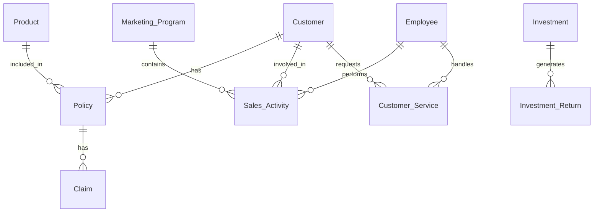

# Entity Relationship Diagram - Perusahaan Asuransi

## Entities dan Atribut (Sesuai Skema Terbaru)

### 1. Customer
- customer_key (PK, surrogate)
- customer_id (business key)
- nama
- tanggal_lahir
- alamat
- referral_code
- tanggal_daftar
- umur (calculated)
- lama_menjadi_pelanggan (calculated)
- valid_from
- valid_to
- is_current
- batch_id
- created_at
- updated_at

### 2. Product
- product_key (PK, surrogate)
- product_id (business key)
- nama_product
- jenis_product
- manfaat
- premi_dasar
- kategori_premi (calculated)
- valid_from
- valid_to
- is_current
- batch_id
- created_at
- updated_at

### 3. Policy (Polis)
- policy_key (PK, surrogate)
- policy_id (business key)
- customer_id (original)
- product_id (original)
- customer_key (FK)
- product_key (FK)
- tanggal_mulai
- tanggal_berakhir
- status
- status_polis
- premium
- payment_frequency
- payment_method
- sum_assured
- durasi_polis (calculated)
- valid_from
- valid_to
- is_current
- batch_id
- created_at
- updated_at

### 4. Claim
- claim_key (PK, surrogate)
- claim_id (business key)
- policy_key (FK)
- customer_key (FK)
- time_key_submitted (FK)
- time_key_decision (FK)
- claim_type
- claim_amount
- approved_amount
- status
- processing_days (calculated)
- rejection_flag
- paid_flag
- batch_id
- created_at

### 5. Employee
- employee_key (PK, surrogate)
- employee_id (business key)
- nama
- tanggal_lahir
- alamat
- jabatan
- department
- tanggal_masuk
- umur (calculated)
- masa_kerja (calculated)
- valid_from
- valid_to
- is_current
- batch_id
- created_at
- updated_at

### 6. Marketing_Program
- program_key (PK, surrogate)
- program_id (business key)
- nama_program
- start_date
- end_date
- target
- description
- jenis_program
- budget
- program_status (calculated)
- durasi_program (calculated)
- valid_from
- valid_to
- is_current
- batch_id
- created_at
- updated_at

### 7. Time
- time_key (PK, surrogate)
- date_actual
- day_of_week
- day_name
- day_of_month
- day_of_year
- week_of_year
- month_actual
- month_name
- quarter_actual
- year_actual
- is_weekend
- is_holiday
- holiday_name
- fiscal_year
- created_at

## Relationships

1. Customer - Policy
   - One-to-Many (Satu customer bisa memiliki banyak polis)

2. Product - Policy
   - One-to-Many (Satu produk bisa ada di banyak polis)

3. Policy - Claim
   - One-to-Many (Satu polis bisa memiliki banyak klaim)

4. Employee - Sales_Activity
   - One-to-Many (Satu karyawan bisa melakukan banyak aktivitas sales)

5. Marketing_Program - Sales_Activity
   - One-to-Many (Satu program marketing bisa memiliki banyak aktivitas sales)

6. Customer - Sales_Activity
   - One-to-Many (Satu customer bisa terlibat dalam banyak aktivitas sales)

7. Investment - Investment_Return
   - One-to-Many (Satu investasi bisa memiliki banyak return)

8. Customer - Customer_Service
   - One-to-Many (Satu customer bisa memiliki banyak layanan)

9. Employee - Customer_Service
   - One-to-Many (Satu karyawan bisa menangani banyak layanan customer)

## Diagram

## Keterangan Tambahan

1. **Policy** menjadi entitas penghubung utama antara Customer dan Product
2. **Sales_Activity** mencatat semua aktivitas marketing dan sales yang dilakukan employee
3. **Investment_Return** mencatat hasil investasi secara periodik
4. **Customer_Service** mencatat semua interaksi layanan dengan pelanggan

## Logika ETL Airflow hingga Data Dashboard

### 1. Extract
- Data diambil dari database operasional (source) menggunakan Airflow DAG.
- Setiap entitas (customer, product, policy, claim, employee, dsb) memiliki task extract yang menjalankan query SQL untuk mengambil data mentah dari tabel sumber.
- Contoh:  
  - `SELECT * FROM customer`  
  - `SELECT * FROM employee`  
  - `SELECT * FROM claim`  
  - dst.

### 2. Transform
- Data hasil extract diolah di Python (menggunakan pandas) untuk:
  - Menghitung field turunan (umur, masa_kerja, durasi_polis, dsb).
  - Melakukan mapping foreign key ke dimensi lain (misal: customer_key, product_key, policy_key).
  - Menentukan status (misal: status_polis, program_status).
  - Menambah metadata: batch_id, valid_from, valid_to, is_current.
  - Membersihkan dan menyesuaikan format data (tanggal, tipe data, dsb).
- Contoh transformasi:
  - `umur = EXTRACT(YEAR FROM AGE(CURRENT_DATE, tanggal_lahir))`
  - `masa_kerja = (CURRENT_DATE - tanggal_masuk)::int`
  - Mapping: join ke tabel dimensi untuk mendapatkan surrogate key.

### 3. Load
- Data hasil transform dimasukkan ke tabel dimensi dan fakta di data warehouse (Postgres DWH).
- Insert dilakukan dengan PostgresHook atau operator SQL di Airflow.
- Untuk dimensi bertipe SCD (Slowly Changing Dimension), update dilakukan pada record lama (`is_current = FALSE, valid_to = now()`) dan insert record baru (`is_current = TRUE, valid_from = now()`)

### 4. Pembuatan Data Dashboard
- Setelah seluruh proses ETL selesai, data di DWH sudah terstruktur dalam bentuk star schema (dimensi & fakta).
- Terdapat DAG khusus (`export_dashboard_data.py`) yang mengekstrak data agregat/summary dari DWH untuk kebutuhan dashboard.
- Proses export ini:
  - Menjalankan query agregasi (misal: total pelanggan, jumlah klaim, premi, dsb) sesuai kebutuhan dashboard.
  - Hasil query diekspor ke file CSV di folder `/data/dashboard/` (misal: `customer_metrics_YYYYMMDD.csv`, `claims_metrics_YYYYMMDD.csv`).
  - File CSV ini digunakan oleh aplikasi dashboard (BI tools, dsb) untuk visualisasi.

### 5. Alur End-to-End
1. **Extract** data mentah dari source DB →  
2. **Transform** di Python (pandas) →  
3. **Load** ke tabel dimensi & fakta di DWH →  
4. **Export** data summary/agregat ke file CSV →  
5. **Visualisasi** di dashboard.

### 6. Contoh Proses untuk Employee (dim_employee)
- **Extract:**  
  Query ke tabel `employee` di source DB.
- **Transform:**  
  Hitung umur dan masa kerja, tambah batch_id, valid_from, dsb.
- **Load:**  
  Insert ke tabel `dim_employee` di DWH.
- **Export:**  
  Data employee yang sudah terintegrasi bisa digunakan untuk analisis kinerja, distribusi usia, dsb di dashboard.

---