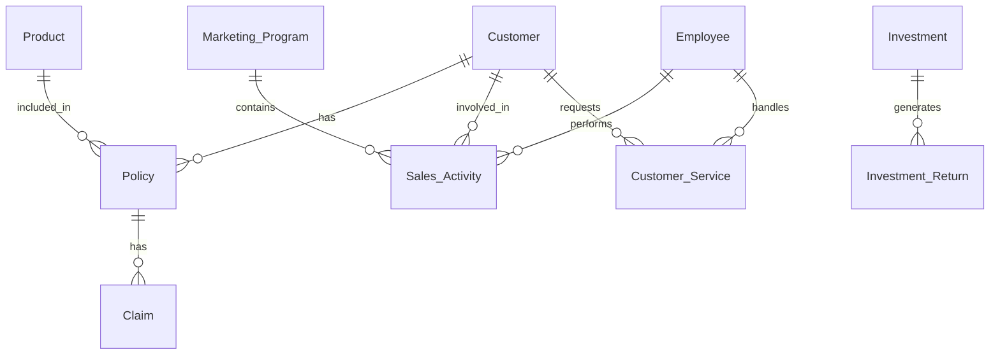

# Entity Relationship Diagram - Perusahaan Asuransi

## Entities dan Atribut

### 1. Customer
- customer_id (PK)
- nama
- tanggal_lahir
- alamat
- referral_code
- tanggal_daftar

### 2. Product
- product_id (PK)
- nama_product
- jenis_product
- manfaat
- premi_dasar

### 3. Policy (Polis)
- policy_id (PK)
- customer_id (FK)
- product_id (FK)
- tanggal_mulai
- tanggal_berakhir
- status_policy
- premi_actual

### 4. Claim
- claim_id (PK)
- policy_id (FK)
- tanggal_pengajuan
- tanggal_kejadian
- status_klaim
- nominal_klaim

### 5. Employee
- employee_id (PK)
- nama
- position
- department
- join_date

### 6. Marketing_Program
- program_id (PK)
- nama_program
- start_date
- end_date
- target
- description

### 7. Sales_Activity
- activity_id (PK)
- employee_id (FK)
- program_id (FK)
- customer_id (FK)
- product_id (FK)
- tanggal_activity
- status
- notes

### 8. Investment
- investment_id (PK)
- jenis_investasi
- nominal
- target_return
- start_date
- end_date
- sumber_dana

### 9. Investment_Return
- return_id (PK)
- investment_id (FK)
- tanggal
- profit
- notes

### 10. Customer_Service
- service_id (PK)
- customer_id (FK)
- employee_id (FK)
- channel
- kategori_keluhan
- deskripsi
- tanggal_input
- status
- sla
- resolution_date

## Relationships

1. Customer - Policy
   - One-to-Many (Satu customer bisa memiliki banyak polis)

2. Product - Policy
   - One-to-Many (Satu produk bisa ada di banyak polis)

3. Policy - Claim
   - One-to-Many (Satu polis bisa memiliki banyak klaim)

4. Employee - Sales_Activity
   - One-to-Many (Satu karyawan bisa melakukan banyak aktivitas sales)

5. Marketing_Program - Sales_Activity
   - One-to-Many (Satu program marketing bisa memiliki banyak aktivitas sales)

6. Customer - Sales_Activity
   - One-to-Many (Satu customer bisa terlibat dalam banyak aktivitas sales)

7. Investment - Investment_Return
   - One-to-Many (Satu investasi bisa memiliki banyak return)

8. Customer - Customer_Service
   - One-to-Many (Satu customer bisa memiliki banyak layanan)

9. Employee - Customer_Service
   - One-to-Many (Satu karyawan bisa menangani banyak layanan customer)

## Diagram

## Keterangan Tambahan

1. **Policy** menjadi entitas penghubung utama antara Customer dan Product
2. **Sales_Activity** mencatat semua aktivitas marketing dan sales yang dilakukan employee
3. **Investment_Return** mencatat hasil investasi secara periodik
4. **Customer_Service** mencatat semua interaksi layanan dengan pelanggan