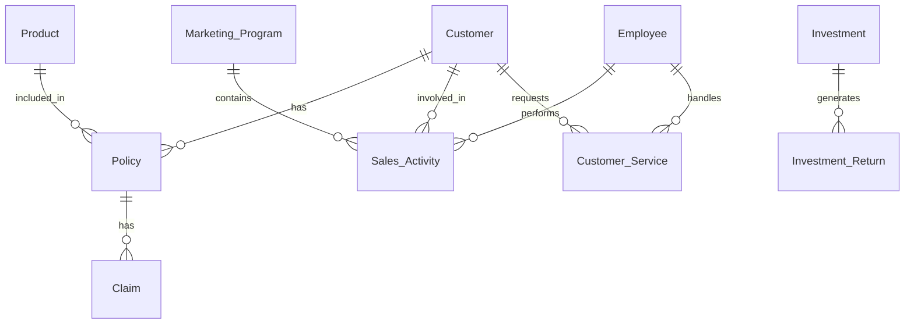

# Entity Relationship Diagram - Perusahaan Asuransi

## Entities dan Atribut (Sesuai Skema Terbaru)

### 1. Customer
- customer_key (PK, surrogate)
- customer_id (business key)
- nama
- tanggal_lahir
- alamat
- referral_code
- tanggal_daftar
- umur (calculated)
- lama_menjadi_pelanggan (calculated)
- valid_from
- valid_to
- is_current
- batch_id
- created_at
- updated_at

### 2. Product
- product_key (PK, surrogate)
- product_id (business key)
- nama_product
- jenis_product
- manfaat
- premi_dasar
- kategori_premi (calculated)
- valid_from
- valid_to
- is_current
- batch_id
- created_at
- updated_at

### 3. Policy (Polis)
- policy_key (PK, surrogate)
- policy_id (business key)
- customer_id (original)
- product_id (original)
- customer_key (FK)
- product_key (FK)
- tanggal_mulai
- tanggal_berakhir
- status
- status_polis
- premium
- payment_frequency
- payment_method
- sum_assured
- durasi_polis (calculated)
- valid_from
- valid_to
- is_current
- batch_id
- created_at
- updated_at

### 4. Claim
- claim_key (PK, surrogate)
- claim_id (business key)
- policy_key (FK)
- customer_key (FK)
- time_key_submitted (FK)
- time_key_decision (FK)
- claim_type
- claim_amount
- approved_amount
- status
- processing_days (calculated)
- rejection_flag
- paid_flag
- batch_id
- created_at

### 5. Employee
- employee_key (PK, surrogate)
- employee_id (business key)
- nama
- tanggal_lahir
- alamat
- jabatan
- department
- tanggal_masuk
- umur (calculated)
- masa_kerja (calculated)
- valid_from
- valid_to
- is_current
- batch_id
- created_at
- updated_at

### 6. Marketing_Program
- program_key (PK, surrogate)
- program_id (business key)
- nama_program
- start_date
- end_date
- target
- description
- jenis_program
- budget
- program_status (calculated)
- durasi_program (calculated)
- valid_from
- valid_to
- is_current
- batch_id
- created_at
- updated_at

### 7. Time
- time_key (PK, surrogate)
- date_actual
- day_of_week
- day_name
- day_of_month
- day_of_year
- week_of_year
- month_actual
- month_name
- quarter_actual
- year_actual
- is_weekend
- is_holiday
- holiday_name
- fiscal_year
- created_at

## Relationships

1. Customer - Policy
   - One-to-Many (Satu customer bisa memiliki banyak polis)

2. Product - Policy
   - One-to-Many (Satu produk bisa ada di banyak polis)

3. Policy - Claim
   - One-to-Many (Satu polis bisa memiliki banyak klaim)

4. Employee - Sales_Activity
   - One-to-Many (Satu karyawan bisa melakukan banyak aktivitas sales)

5. Marketing_Program - Sales_Activity
   - One-to-Many (Satu program marketing bisa memiliki banyak aktivitas sales)

6. Customer - Sales_Activity
   - One-to-Many (Satu customer bisa terlibat dalam banyak aktivitas sales)

7. Investment - Investment_Return
   - One-to-Many (Satu investasi bisa memiliki banyak return)

8. Customer - Customer_Service
   - One-to-Many (Satu customer bisa memiliki banyak layanan)

9. Employee - Customer_Service
   - One-to-Many (Satu karyawan bisa menangani banyak layanan customer)

## Diagram

## Keterangan Tambahan

1. **Policy** menjadi entitas penghubung utama antara Customer dan Product
2. **Sales_Activity** mencatat semua aktivitas marketing dan sales yang dilakukan employee
3. **Investment_Return** mencatat hasil investasi secara periodik
4. **Customer_Service** mencatat semua interaksi layanan dengan pelanggan