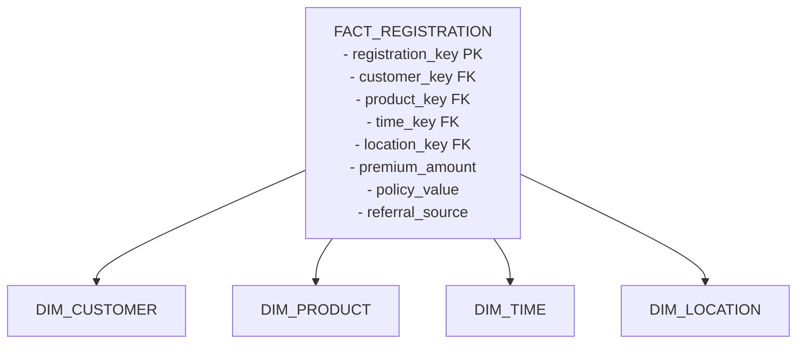
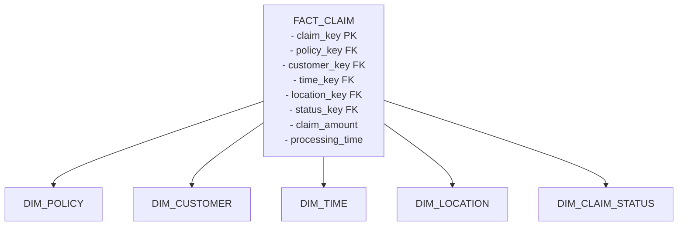
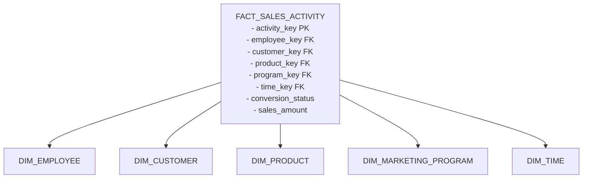
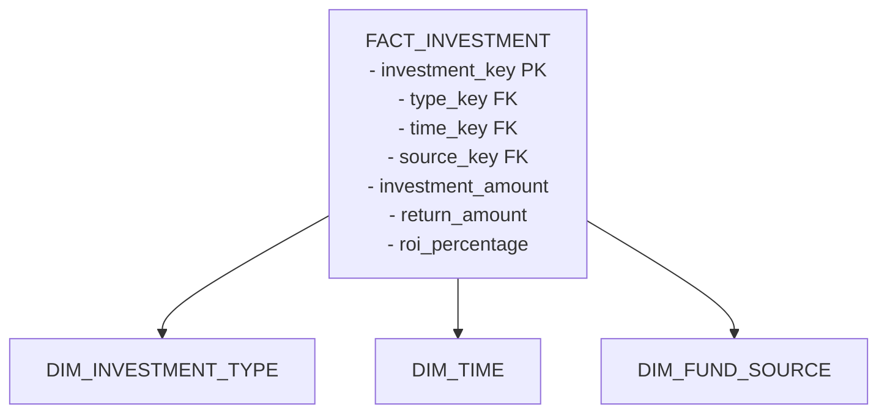
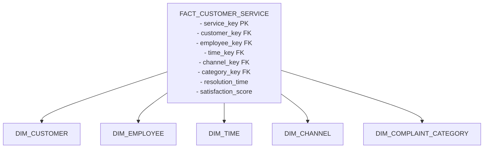

# Star Schema dan Enterprise Bus Matrix

## Enterprise Bus Matrix

| Dimension Tables    | FACT_REGISTRATION | FACT_CLAIM | FACT_SALES_ACTIVITY | FACT_INVESTMENT | FACT_CUSTOMER_SERVICE |
|--------------------|-------------------|------------|-------------------|----------------|---------------------|
| DIM_CUSTOMER       | ✓                | ✓          | ✓                 |                | ✓                   |
| DIM_PRODUCT        | ✓                |            | ✓                 |                |                     |
| DIM_EMPLOYEE       |                  |            | ✓                 |                | ✓                   |
| DIM_TIME          | ✓                | ✓          | ✓                 | ✓              | ✓                   |
| DIM_LOCATION      | ✓                | ✓          |                   |                |                     |
| DIM_POLICY        |                  | ✓          |                   |                |                     |
| DIM_CLAIM_STATUS  |                  | ✓          |                   |                |                     |
| DIM_MARKETING_PROGRAM |               |            | ✓                 |                |                     |
| DIM_INVESTMENT_TYPE |                 |            |                   | ✓              |                     |
| DIM_FUND_SOURCE   |                  |            |                   | ✓              |                     |
| DIM_CHANNEL       |                  |            |                   |                | ✓                   |
| DIM_COMPLAINT_CATEGORY |              |            |                   |                | ✓                   |

## Star Schema Detail

### 1. FACT_REGISTRATION

### 2. FACT_CLAIM

### 3. FACT_SALES_ACTIVITY

### 4. FACT_INVESTMENT

### 5. FACT_CUSTOMER_SERVICE

## Measures (Metrics) per Fact Table

### FACT_REGISTRATION
- Jumlah pendaftaran baru
- Total premium
- Total nilai polis
- Rata-rata premium per produk
- Konversi dari referral

### FACT_CLAIM
- Jumlah klaim
- Total nilai klaim
- Rata-rata waktu pemrosesan
- Rasio klaim per polis
- Distribusi status klaim

### FACT_SALES_ACTIVITY
- Total aktivitas sales
- Tingkat konversi
- Revenue per sales
- Efektivitas program marketing
- Produktivitas sales

### FACT_INVESTMENT
- Total investasi
- Total return
- ROI
- Performa per jenis investasi
- Distribusi sumber dana

### FACT_CUSTOMER_SERVICE
- Jumlah keluhan
- Rata-rata waktu resolusi
- Tingkat kepuasan
- Distribusi kategori keluhan
- Performa layanan per channel